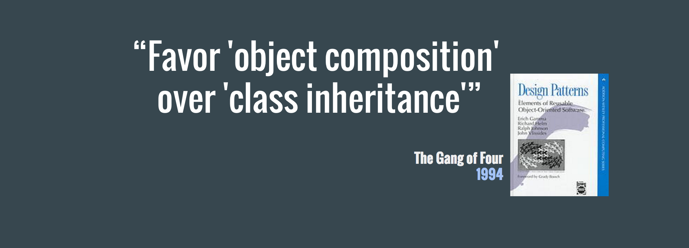

# The magical world of Componentisation

Several months ago I gave a talk at one of our fortnightly **Unruly Tech Talks** about a topic that I had been mulling around in my head for several months prior.
The topic was that of an architecture abstraction, triggered by my adoption of the *React* library in order to declaratively construct user interfaces.

But we'll get to *React* in a moment. First I'd like to ask you an existential question.

**What's the core of our job as developers today?**

It probably **isn't** is *figuring out the next super cool & complex algorithm.*

But rather, what our job probably **is**, is to *take an existing abstraction and compose it with a second abstraction in order to form a third abstraction*.

## Modularisation

I've been using *React* for a couple of years now, following many years of evangelising *Backbone* as a solution to the problems my clients and employers had been facing when tackling their Front End architectures. As a relatively early adopter of Backbone, in early 2011, I found the move from a messy soup of global Javascript objects with complex prototypical hierarchies, to a structured MVC (or rather, MVP) pattern an extremely pleasing step forward.

Backbone allowed us to focus less one how the pieces of our code fit together, and more on what they actually did. It did this by abstracting away a lot of the boilerplate and defining a clear API for each piece of our system.
This might seem obvious in hindsight, but at the time this felt groundbreaking, mostly because we were so used to Front End code existing as *a pile of code held together by duct tape* that we accepted our fate and found it hard to see that a better options existed.

But the key *unique selling point* of Backbone, beyond removing boilerplate and an enforced API, was the fact that it lay the ground work for proper **modularisation** of our Javascript codebases.

Modules are a corner stone of good code structuring, as they encourage us to break our code down into individual logical pieces. This makes it easier for us to write maintainable code that's easier to reason about, to test and to reuse.

## Rachel's Trifle
Backbone, though, as it turned out, was not the be-all and end-all solution to our problems.

While we leveraged the benefits of MVC and other patterns to lay out our architecture into multitiered Object Oriented designs, striving for separation of concerns by layering our modules, designing inheritance chains meant to improve code reuse
and reduce complexity, we would inevitably hit the same wall.

As a codebase would grow, requirements changed and assumptions were discovered to be incorrect, we often find that our abstractions begin to fail us.

What we would initially envision as a well thought out and layered Trifle, turned out to be more a mixed up recipe, where layers don't quite make sense anymore, they end up seeping into the layers above and bellow them and something just doesn't taste quite right anymore. This in turn makes it harder to reuse code, to test it and to maintain it.


*Rachel's Trifle? Good. **Code Trifle**? Bad.*

In other words, our code would develop a smell... the unmistakable smell of a Custard, Jam, Mashed Potatoes and Meat dessert.

## Wait, but why?
Einstein never actually said that *insanity is doing the same thing over and over again and expecting different results*, but I'd like to think that he would agree that if we find ourselves repeating a mistake, we should probably rethink our approach.

I tried to identify the root causes for why, I believed, so many of the teams I'd worked on ended up with these code smells.

**Building complex and / or distributed state machines**
We often try to manage state in many different places and try to reconcile this state throughout the lifecycle of the application. This is hard to do well, and leads to many implicit assumptions which easily break.

**Big bags of instruction rather than atomic declarative pipes**
Instruction are easy to follow, but not always easy to understand. They usually describe *how* something is done, rather than *why*, and the developers are left to figure out the *why* themselves. We've all found ourselves doing this, referring to it as *reverse engineering own our code* and we often misinterpret the *why*.

**Terrible dependency chains reducing our ability to make atomic components**
We often find it hard to make truly atomic pieces of code as they have an inherent *need* for a piece of data or operation that is the concern of another piece of the code. This dependency will always exist in a complex system, but in the absence of a clear API for bridging these dependencies without creating a cohesive coupling between the two pieces of code, this can lead to dependency chains which are hard to reconcile.

**Trying to predict the future**
By far the biggest culprit for the dank code smell is a habit developers have of trying to predict how their code will be used instead of focusing on what is needed. This can lead to many problematic implementations, but most of all it leads to over engineering of solutions, which often leads to code that is very hard to *delete* later.
I'm a firm believer that the best code is code that can easily be deleted and over engineering often makes that much harder to do.

### Searching for answers
Having boiled down my problem to its root causes, the next step would be to figure out what I could do to reduce their impact on how I write my code.
When looking at the aforementioned points, I believe they can be reduces to one core issue, which is that my code would often end up with **High Efferent Coupling & Fragmented State**.

Which begged the question:
***How on earth do we reduce our efferent coupling & fragmented State?***

Searching high and low for an answer I hit the internet, the books, the tech talks, my dad (I didn't literally hit my dad, I just asked his opinion, as he's been writing code since the 70s, presumably with hippie hair and a spliff) and found that there are in fact many possible answers to this question.

I won't enumerate all of them, but one answer would show up repeatedly, and that was a quote which I'd heard so many times before:



> **Side note:** *Note the year in which this book, considered a religious tome by many developers, was released. 1994. 22 years ago. That's it. If anything should remind you that we're still "just figuring out this shit, because it's bloody new", it's that fact.*

In fact, this quote has been repeated so many times by so many people, I've began to find it *eye-roll inducing*.

The reason I found this quote so annoying was that the more I spoke about this topic with experienced developers whom I looked up to, the more I found this quote to a reminder of another quote.


While it seemed many developers appreciated the wisdom in this advice, reflected in the fact that it has been featured in innumerable talks and blog posts, very few could actually show me *how to achieve this*.

*Composability* is not an inherently clear idea, and while many developers seems perfectly capable of coding up an example in an IDE, they never seemed to actually follow through when it came to their codebase. And most annoying, they knew it, but couldn't quite translate these theory into practicality, once they had real problems they needed to solve.

### What is Composition?
So to figure out how to achieve *composability*, we first need to understand what *composition* actually means.

As far as I can see, there are two kinds of composition.

The first is **functional composition**. I'll assume for the sake of succinctness, that you already know what functional composition is, as this blog post is already way too long.

But just to make sure we're on the same page I'll clarify that what I mean by functional composition is that the **h** function is the *functional composition* of the **g** and **f** functions.
```javascript
const g = () => {}
const f = () => {}
const h = (...args) => g(f(...args))
```

But the second kind of composition is **object composition**, and this is where I got stuck.

I just couldn't figure out how to take Object Composition in theory and apply it in practice. How to structure my pieces of code and make them work together, without relegating back to old and smelly practices.

#### What is Object Composition?
[Eric Elliot](https://twitter.com/_ericelliott) gave a really good talk at [Fluent 2013](https://www.youtube.com/watch?v=lKCCZTUx0sI) in which he explains object composition and its benefits in a much better way than I ever could, so I'd highly recommend watching his talk.

But after experimenting with Eric's proposed solution, a library called [StampIt](https://github.com/stampit-org/stampit), I still couldn't see how I could avoid the high Efferent Coupling I was experiencing, nor did it do much to help me tackle the fragmented state.

This feeling of frustration with the smell of my code would stay with me for a while, until recently, when I began using *React* in production. It wasn't immediately apparent to me how React seemed to alleviate many of the problems I was experiencing, nor do I want to tote React as necceserily a *solution* to these problems.

What I have found *React* to be is an opportunity to alleviate many of the causes for these code smells, and that's the actual topic I want to talk about.

## Composability via Componentisation
I often hear developers talk about the difference between the *react* package and the *react-dom* package, and how the separation provides the ability to use *React*'s *component tree diffing* algorithm to build any kind of UI. But when it comes to discussing *React*'s composability, we actually need to start looking at the internals of the core *react* package.


